# stremio-core-ts-wrapper

**A comprehensive, strongly-typed TypeScript abstraction layer over `@stremio/stremio-core-web`.**

This library serves as the bridge between a React/Next.js frontend and Stremio's Rust-based core logic (compiled to WebAssembly). It provides a type-safe contract for state management, action dispatching, event handling, and addon data retrieval, implementing the "Elm Architecture" pattern adapted for modern React applications.

## Table of Contents

1. [System Architecture](#system-architecture)
2. [Key Concepts](#key-concepts)
3. [Installation & Setup](#installation--setup)
4. [Quick Start](#quick-start)
5. [Core Systems Deep Dive](#core-systems-deep-dive)
   - [Core Transport & WASM](#core-transport--wasm)
   - [State Management (TanStack Query)](#state-management-tanstack-query)
   - [Action System (ActionBuilder)](#action-system-actionbuilder)
   - [Event System](#event-system)
   - [Data Fetching (AddonClient)](#data-fetching-addonclient)
6. [Developer Tools](#developer-tools)
7. [Project Structure](#project-structure)
8. [Documentation Links](#documentation-links)

---

## System Architecture

The wrapper implements a unidirectional data flow. The frontend never modifies state directly; it dispatches actions to the Core, which processes them and emits new state events.

```mermaid
flowchart TD
    classDef frontend fill:#eef2ff,stroke:#4f46e5,stroke-width:2px,color:#1e1b4b,rx:5,ry:5
    classDef hook fill:#c7d2fe,stroke:#4338ca,stroke-width:1px,color:#1e1b4b,rx:5,ry:5
    classDef provider fill:#f5f3ff,stroke:#7c3aed,stroke-width:2px,color:#1e1b4b,rx:5,ry:5
    classDef wrapperLogic fill:#ecfdf5,stroke:#059669,stroke-width:2px,color:#064e3b,rx:5,ry:5
    classDef transport fill:#fffbeb,stroke:#d97706,stroke-width:2px,color:#78350f,rx:5,ry:5
    classDef storage fill:#eff6ff,stroke:#2563eb,stroke-width:2px,color:#1e3a8a,stroke-dasharray: 3 3
    classDef wasm fill:#fef2f2,stroke:#dc2626,stroke-width:3px,color:#7f1d1d,rx:5,ry:5
    classDef external fill:#f3f4f6,stroke:#4b5563,stroke-width:1px,stroke-dasharray: 5 5,color:#1f2937
    subgraph UI_Layer ["Frontend Application Layer (Next.js)"]
        direction TB
        Components["React Components<br/>(Board, Library, Detail, Player)"]:::frontend
        DebugCenter["StremioCoreWebDebugCenter<br/>(Developer Tools)"]:::frontend
    end
    subgraph React_Integration ["Wrapper React Integration Layer"]
        direction TB

        subgraph Providers ["Context Providers"]
            CoreProvider["StremioCoreProvider<br/>(WASM Lifecycle, Global Events, Proxy Enforcement)"]:::provider
        end

        subgraph Hooks_Public ["Domain Hooks (Public API)"]
            direction LR
            useCtx["useCtx()<br/>(Profile, Settings, Addons)"]:::hook
            useBoard["useBoard()<br/>(Catalogs, Recs)"]:::hook
            useLibrary["useLibrary()<br/>(Items, History)"]:::hook
            useAuth["useAuthActions()<br/>(Login, Register)"]:::hook
        end

        subgraph Hooks_Internal ["Core Infrastructure Hooks"]
            direction LR
            useDispatch["useDispatch()<br/>(Action Dispatcher)"]:::hook
            useCoreQuery["useCoreQuery()<br/>(TanStack Query Wrapper)"]:::hook
        end
    end
    subgraph Wrapper_Logic ["Wrapper Logic Layer"]
        direction TB

        ActionBuilder["ActionBuilder (Static Class)<br/>Constructs Type-Safe JSON Actions"]:::wrapperLogic

        StateParser["StateParser (Static Class)<br/>Validates & Transforms Raw JSON -> Typed TS Objects"]:::wrapperLogic

        AddonClient["AddonClient (Static Class)<br/>HTTP Fetcher for Catalog Content"]:::wrapperLogic
    end
    subgraph Transport_Layer ["Transport & State Management"]
        direction TB

        QueryCache[("TanStack Query Cache<br/>(In-Memory State Store)")]:::storage

        CoreTransport["CoreTransport Class<br/>(Worker Manager & Bridge Wrapper)"]:::transport

        EventEmitter["EventEmitter<br/>(Events: 'NewState', 'CoreEvent')"]:::transport
    end
    subgraph WASM_Kernel ["@stremio/stremio-core-web (Submodule)"]
        direction TB
        Bridge["Bridge (JS <-> WASM Interface)"]:::wasm
        WebWorker["Web Worker (worker.js)"]:::wasm
        RustCore["Rust Core Logic<br/>(The 'Brain' - Holds Source of Truth)"]:::wasm
    end
    subgraph External_World ["External Infrastructure"]
        direction LR
        AddonAPIs["External Addon APIs<br/>(Cinemeta, etc.)"]:::external
        ProxyAPI["Next.js Proxy Route<br/>(/api/proxy)"]:::external
        StreamingServer["Local Streaming Server<br/>(127.0.0.1:11470)"]:::external
    end
    CoreProvider --"1. new CoreTransport()"--> CoreTransport
    CoreTransport --"2. Spawn Worker"--> WebWorker
    WebWorker --"3. Init Success"--> CoreTransport
    CoreProvider --"4. Dispatch Init Actions"--> useDispatch
    Components -->|Subscribe| Hooks_Public
    Hooks_Public -->|Derive State| useCoreQuery
    useCoreQuery -->|Read| QueryCache
    useCoreQuery --"On Cache Miss"--> CoreTransport
    CoreTransport --"getState(model)"--> Bridge
    Bridge --> WebWorker
    WebWorker --"Raw JSON State"--> Bridge
    Bridge --> CoreTransport
    CoreTransport --"Raw State"--> StateParser
    StateParser --"Typed Model"--> useCoreQuery
    useCoreQuery --"Update Cache"--> QueryCache
    Components -->|Trigger| useAuth
    Components -->|Trigger| useDispatch
    useAuth --> useDispatch

    useDispatch --"1. Get Action JSON"--> ActionBuilder
    useDispatch --"2. dispatch(action, model)"--> CoreTransport
    CoreTransport --> Bridge
    Bridge --> WebWorker
    WebWorker -->|Process Action| RustCore
    RustCore --"State Modified"--> WebWorker
    WebWorker --"Emit 'NewState'"--> Bridge
    Bridge --> EventEmitter
    EventEmitter --"Broadcast ['model_name']"--> useCoreQuery
    useCoreQuery --"Invalidate Query Key"--> QueryCache
    QueryCache --"Trigger Refetch"--> useCoreQuery
    Components -.->|Request Catalog Content| AddonClient
    AddonClient -->|1. Direct Fetch| AddonAPIs
    AddonClient -->|2. Fallback CORS | ProxyAPI
    ProxyAPI --> AddonAPIs
    DebugCenter -.->|Inspect Transport| CoreTransport
    DebugCenter -.->|Listen to Events| EventEmitter
    DebugCenter -.->|Dispatch Raw JSON| CoreTransport
    EventEmitter --"UserAuthenticated"--> CoreProvider
    CoreProvider --"Enforce Proxy Settings"--> useDispatch
    useCtx --> StateParser
    useBoard --> StateParser
    useLibrary --> StateParser
    useAuth --> ActionBuilder
```



---

## Key Concepts

### 1. The "Elm Architecture" in React

Stremio Core follows the Elm architecture: **Model**, **View**, and **Update**.

- **Model**: Held entirely within the Rust Core.
- **View**: The React Frontend (derived from Core state).
- **Update**: Triggered strictly via Actions dispatched to Core.

### 2. Strict Type Safety

Raw WASM data is unstructured JSON. This wrapper enforces strict TypeScript interfaces for all:

- **Models**: `CtxState`, `BoardState`, `LibraryItem`, `MetaItem`, etc.
- **Actions**: `ActionCtx`, `ActionLoad`, `ActionPlayer`.
- **Parsers**: `StateParser` validates and transforms raw data into safe TS objects before the UI sees them.

### 3. React Integration via TanStack Query

State synchronization is handled via custom hooks (`useCoreQuery`) that leverage TanStack Query. This provides:

- Automatic cache invalidation based on Core events.
- Deduplicated state reads.
- Memory management for expensive state objects.

### 4. Hybrid Data Fetching

While "User State" (Library, Settings, Auth) lives in Core/WASM, "Catalog Content" (Movies, Series) is often fetched directly via HTTP to reduce WASM overhead. The wrapper provides `AddonClient` for this purpose.

---

## Installation & Setup

This wrapper is designed to be used as a Git submodule or internal package within a monorepo.

### Prerequisites

1. **Stremio Core Web**: The project depends on `@stremio/stremio-core-web`.
2. **Worker Setup**: The `worker.js` file from `@stremio/stremio-core-web` must be copied to the public directory of the host application (e.g., `public/worker.js`).

### Provider Setup

Wrap the application root with `StremioCoreProvider`. This handles the WASM initialization lifecycle.

```tsx
// src/app/layout.tsx
import { StremioCoreProvider } from "@/stremio-core-ts-wrapper/src/providers/StremioCoreProvider";

export default function RootLayout({ children }) {
  return <StremioCoreProvider>{children}</StremioCoreProvider>;
}
```

---

## Quick Start

### 1. Reading State

Use specific hooks to read data. The hooks handle parsing and error states.

```tsx
import { useCtx, useBoard } from "@/stremio-core-ts-wrapper";

function Dashboard() {
  // Access Global Context (Profile, Addons, Settings)
  const { profile, isAuthenticated, addons, isLoading } = useCtx();

  // Access Board (Catalogs, Recommendations)
  const { catalogs } = useBoard();

  if (isLoading) return <div>Loading Core...</div>;

  return (
    <div>
      <h1>Hello, {isAuthenticated ? profile.email : "Guest"}</h1>
      <div>Installed Addons: {addons.length}</div>
    </div>
  );
}
```

### 2. Dispatching Actions

Use `useDispatch` combined with `ActionBuilder` to modify state.

```tsx
import { useDispatch, ActionBuilder } from "@/stremio-core-ts-wrapper";

function LoginButton() {
  const dispatch = useDispatch();

  const handleLogin = async () => {
    // 1. Construct the Type-Safe Action
    const action = ActionBuilder.Auth.login("user@example.com", "password123");

    // 2. Dispatch to the specific model ("ctx")
    try {
      await dispatch(action, "ctx");
    } catch (e) {
      console.error("Login failed", e);
    }
  };

  return <button onClick={handleLogin}>Login</button>;
}
```

---

## Core Systems Deep Dive

### Core Transport & WASM

**File:** `src/core/core-transport.ts`

The `CoreTransport` class is the low-level singleton that manages the Web Worker. It initializes the WASM bridge using `@stremio/stremio-core-web/bridge`.

- **Initialization**: Loads `worker.js` and calls the internal `init` endpoint.
- **Event Loop**: Exposes an `EventEmitter` that broadcasts messages from Rust to the UI.
- **Methods**:
  - `dispatch(action, model)`: Sends a JSON string to Core.
  - `getState(model)`: Synchronously retrieves a snapshot of a specific model.
  - `decodeStream(stream)`: Analytics and stream resolution helpers.

### State Management (TanStack Query)

**File:** `src/hooks/use-core-model.ts`

The wrapper uses a sophisticated caching strategy to keep the UI in sync with WASM without over-fetching.

1. **Event Listening**: The `useCoreQuery` hook subscribes to `NewState` events emitted by `CoreTransport`.
2. **Selective Invalidation**: When `NewState` fires, the event payload contains a list of changed models (e.g., `['ctx', 'library']`).
3. **Refetching**: If the hook is observing a model that changed, it triggers a `queryClient.invalidateQueries`.
4. **Parsing**: The fresh raw state is passed through `StateParser` before being returned to the component.

**Example Pattern:**

```typescript
// Inside use-core-model.ts
transport.events.on("NewState", (changedModels) => {
  if (changedModels.includes(modelName)) {
    queryClient.invalidateQueries({ queryKey: ["stremio-core", modelName] });
  }
});
```

### Action System (ActionBuilder)

**File:** `src/core/action-builder.ts`

Stremio Core expects actions as JSON strings representing Rust Enums. Manually constructing these strings is error-prone. `ActionBuilder` provides static methods for every supported action.

**Categories:**

- **Auth**: Login, Register, Logout.
- **User**: PullUser, SyncLibrary, UpdateSettings.
- **Library**: AddItem, RemoveItem, ToggleNotifications.
- **Load**: Navigation actions (Load Board, Load Library, Load Player).
- **Player**: TimeChanged, Ended, Paused, Playing.

**Example:**

```typescript
// Instead of manual JSON:
// '{"action":"Ctx","args":{"action":"AddToLibrary","args":{...}}}'

// Use ActionBuilder:
ActionBuilder.Library.addItem(metaItem);
```

### Event System

**File:** `src/core/core-transport.ts`

The Core emits two primary types of events:

1. **`NewState`**: Indicates data has changed. Payload contains the names of modified models. Used primarily for cache invalidation.
2. **`CoreEvent`**: One-off occurrences (e.g., `UserAuthenticated`, `Error`, `AddonInstalled`). These are often used for UI side effects like redirects or toasts.

The `StremioCoreProvider` listens to `CoreEvent` to handle critical application lifecycle changes, such as enforcing proxy settings upon authentication.

### Data Fetching (AddonClient)

**File:** `src/api/addons/addon-client.ts`

Not all data comes from WASM. Catalog content and metadata are often fetched directly from Addons via HTTP. The `AddonClient` handles this with a robustness layer:

- **Normalization**: Converts `stremio://` protocols to `https://`.
- **Smart Fetch**:
  1. Attempts a direct browser `fetch`.
  2. If CORS fails or the request errors, falls back to a local proxy (`/api/proxy`).
- **Parsing**: Uses `AddonParser` to validate responses against `MetaItem` and `Stream` interfaces.

---

## Developer Tools

### StremioCoreWebDebugCenter

**File:** `src/debug/components/StremioCoreWebDebugCenter.tsx`

The wrapper includes a powerful visual debugger that can be toggled in the application layout.

**Features:**

- **State Inspector**: Live JSON tree view of any Core model (`ctx`, `board`, `player`, etc.) with copy functionality.
- **Event Log**: Real-time feed of `NewState` and `CoreEvent` emissions.
- **Action Dispatcher**: UI for firing common actions (Login, Load Board) or raw custom JSON actions.
- **System Logs**: Internal logs from the `CoreTransport` and `AddonClient`.
- **Simulation**: Tools to simulate Auth login or Stream decoding without using the actual UI.

To enable:

```tsx
// src/app/layout.tsx
const ENABLE_DEBUG = true;

return (
  <WebViewProvider>
    {ENABLE_DEBUG ? (
      <StremioCoreWebDebugCenter />
    ) : (
      <AppShell>{children}</AppShell>
    )}
  </WebViewProvider>
);
```

---

## Project Structure

```tree
src/stremio-core-ts-wrapper/
├── README.md                   # This file
├── docs/                       # Detailed documentation
├── src/
│   ├── api/
│   │   └── addons/             # Addon HTTP Client & Parsers
│   ├── core/
│   │   ├── action-builder.ts   # Action Factory
│   │   ├── core-transport.ts   # WASM Worker Bridge
│   │   └── state-parser.ts     # Raw State -> Typed Object Parsers
│   ├── debug/                  # Debugging Components
│   ├── hooks/
│   │   ├── use-core-model.ts   # Base TanStack Query Hook
│   │   ├── use-dispatch.ts     # Action Dispatcher Hook
│   │   └── ...                 # Domain Hooks (useCtx, useBoard)
│   ├── providers/              # Context Providers
│   └── types/                  # TypeScript Definitions
│       ├── actions/            # Action Interfaces
│       └── models/             # State Model Interfaces
```

---

## Documentation Links

For deeper implementation details, refer to the `docs/` directory:

1. **[Architecture Guide](docs/StremioCoreTypeScriptWrapperArchitecture.md)**
   Detailed breakdown of the "Elm" pattern, type system, and react integration strategies.

2. **[Implementation Checklist](docs/implementation-checklist.md)**
   Tracking document for implemented models, actions, and planned features.

3. **[Feature Workflow](docs/add_new_feature_workflow_template.md)**
   Step-by-step guide for contributors adding new models or actions to the wrapper.

4. **[Visual Architecture](docs/architecture-diagram.mermaid)**
   Mermaid diagram visualizing the data flow between Next.js, the Wrapper, and WASM.
