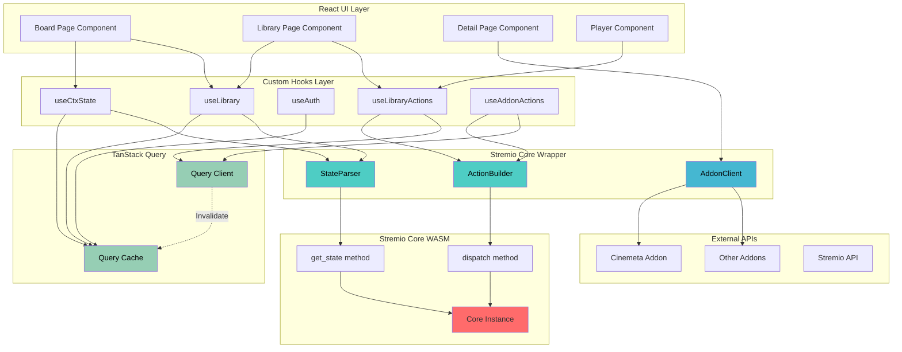

# stremio-core-ts-wrapper

_A strongly-typed TypeScript wrapper around the Stremio Core WebAssembly module._

## Goal

The goal of this repository is to provides clean and well documented TypeScript layer on top of `@stremio/stremio-core-web` (the Rust → WASM bridge used by Stremio's web UI).

Why?

- Provide explicit TypeScript types for Stremio Core models and actions.
- Centralize action construction (ActionBuilder) so dispatches are type-safe and easy to test.
- Offer robust parsers that validate and normalize raw WASM state into safe, predictable shapes.
- Expose ergonomic React hooks (TanStack Query) for reading core state and dispatching actions.
- Ship helper utilities (AddonClient) that fetch addon data over HTTP.

This wrapper is designed to be integrated into the Custom web UI so UI authors can focus on UX while relying a type checked contract with core logic.

---

## What are `stremio-core` and `stremio-core-web`?

- \*\*stremio-core : rust crate that's designed to contain all the reusable logic (types, addon system, UI models, core logic) between Stremio versions
- **stremio-core-web** : The bridge package that compiles Stremio Core (Rust) into a WebAssembly module and provides a minimal JavaScript interface. It exposes `dispatch(actionString)` and `get_state(modelName)` which this wrapper encapsulates with TypeScript types, parsers, and hooks.

(Official repositories are listed in the References section at the end of this README.)

## Wrapper Architecture (Elm-inspired) Diagram



## Wrapper — Progress & Roadmap Checklist (v0)

> This section is mean to be updated regularly, he one will find a a concise, hierarchical checklist that shows what has been completed, what’s planned, and where the relevant code and tasks live.

---

### Phase 1: Foundation Setup ✅ (Already Done!)

- [x] Repository layout established (`/src`, `/docs`).
  - Relevant files: `./src/index.ts`, `./docs/`.
  - See: `./docs/StremioCoreTypeScriptWrapperArchitecture.md`.
- [x] WASM initialization provider and runtime wiring.
  - Done in: `./src/index.ts` and `./src/core/*`.
  - Inspect: `./src/core/state-parser.ts` (reads `core.get_state`) and `./src/core/action-builder.ts` (constructs actions).
- [x] Addon HTTP client implemented.
  - File: `./src/api/addon-client.ts`.
- [x] Base common types added.
  - Files: `./src/types/common/addon.ts`, `./src/types/common/meta-item.ts`, `./src/types/common/stream.ts`.
- [x] Core hooks exposed for consumers.
  - Files: `./src/hooks/use-core-state.ts`, `./src/hooks/use-dispatch.ts`.
- [x] Fetch catalog data via HTTP

### Phase 2: Type System & Core Wrapper

> Goal: provide type-safe models, action builders, and parsers so UI code can be predictable and unit-testable.

#### 2.1 Types & models

- [x] Core model `ctx` added.
  - File: `./src/types/models/ctx.ts`.
- [ ] Additional model files planned (library, board, discover, player, detail).
  - Planned files (not yet present):
    - `./src/types/models/library.ts` — **Pending**. Issue: [#TODO-library](https://github.com/)
    - `./src/types/models/board.ts` — **Pending**. Issue: [#TODO-board](https://github.com/)

**Plan:**

- Implement one model at a time; for each model:
  - Create TypeScript shape in `./src/types/models`.
  - Export it via `./src/types/index.ts` (or `./src/types/stremio-core.d.ts` if needed).

#### 2.2 Actions & ActionBuilder

- [x] Base action types exist (ctx-actions, load-actions).
  - Files: `./src/types/actions/ctx-actions.ts`, `./src/types/actions/load-actions.ts`, `./src/types/actions/index.ts`.
- [x] ActionBuilder core implemented.
  - File: `./src/core/action-builder.ts`.
- [ ] Add strongly-typed builders for new models (per-model).
  - Example to add for `library`:

```ts
// src/core/action-builder.ts (snippet)
static addToLibrary(item: LibraryItem): string {
  return JSON.stringify({ type: 'AddToLibrary', payload: item });
}
```

Issue placeholder: [#TODO-actions](https://github.com/)

#### 2.3 StateParser

- [x] Parser scaffolding present.
  - File: `./src/core/state-parser.ts`.
- [ ] Add parse methods per model (e.g., `parseLibrary`, `parseBoard`).
  - Plan: add Zod schemas or equivalent runtime checks for each model.

**How we will do it:**

1. Write a Zod schema in `./src/core/schemas/library.schema.ts`.
2. Implement `StateParser.parseLibrary(raw)` which returns `LibraryModel`.
3. Add unit tests in `./test` verifying raw → typed conversion.

---

### Phase 3: Add More Models (Do These in Order)

> Prioritized list of models to implement, with per-model subchecklists and paths.

#### 3.1 Library (priority: high)

- [ ] Files
  - `./src/types/models/library.ts`
  - `./src/types/actions/library-actions.ts`
  - `./src/core/schemas/library.schema.ts`
  - `./src/hooks/use-library-state.ts` (query hook)
  - `./src/hooks/use-library-actions.ts` (dispatch helpers)
- [ ] Checklist
  - [ ] Define TypeScript types and JSDoc.
  - [ ] Implement ActionBuilder methods (add/remove/update progress).
  - [ ] Add `StateParser.parseLibrary` and unit tests.
  - [ ] Implement hooks and wire to components.
  - [ ] Manual QA and PR.

**What it does:**

- Manages user's content library
- Track watch progress
- Continue watching

**When to use:**

- Library page
- Continue watching section
- Watch history
- Issue: [#feature-library](https://github.com/)

#### 3.2 Board (priority: medium)

- [ ] Files
  - `./src/types/models/board.ts`
  - `./src/hooks/use-board-state.ts`
- [ ] Checklist
  - [ ] Types
  - [ ] Parser
  - [ ] Hook & UI wiring

**What it does:**

- Provides curated content for the board
- Combines library with recommendations

**When to use:**

- Board page (home page)
- Personalized recommendations
- Issue: [#feature-board](https://github.com/)

#### 3.3 Discover (priority: medium)

- [ ] Files
  - `./src/types/models/discover.ts`
  - `./src/types/actions/discover-actions.ts`
- [ ] Checklist
  - [ ] Types + actions
  - [ ] Parser + hooks
  - [ ] Search & filter helpers

**What it does:**

- Browse catalogs by genre
- Filter by type (movie, series)
- Search functionality

**When to use:**

- Discover page
- Genre browsing
- Advanced filtering
- Issue: [#feature-discover](https://github.com/)

#### 3.4 Detail (priority: medium/high)

- [ ] Files
  - `./src/types/models/detail.ts`
- [ ] Checklist
  - [ ] Types for episodes, seasons, streams
  - [ ] Types for episodes, seasons, streams
  - [ ] Types for episodes, seasons, streams

**What it does:**

- Detailed metadata for specific content
- Episode/season information for series
- Related content

**When to use:**

- Detail pages
- Video player metadata
- Episode selection
- Issue: [#feature-player-detail](https://github.com/)

#### 3.5 Player (priority: medium/high)

- [ ] Files
  - `./src/types/models/player.ts`
  - `./src/types/actions/player-actions.ts`
- [ ] Checklist
  - [ ] Stream Detials parser
  - [ ] Player state parser
  - [ ] Playback hooks & action builders

**What it does:**

- Video playback state
- Subtitle management
- Audio track selection
- Playback progress tracking

**When to use:**

- Video player component
- Progress tracking
- Playback controls
- Issue: [#feature-player-detail](https://github.com/)

---

### Phase 4: Extra features and extendability

> Long-term enhancements that improve observability, integrations, and developer ergonomics.

#### 4.1 Notifications

- [ ] Model & actions for user notifications.
  - Paths: `./src/types/models/notifications.ts`, `./src/hooks/use-notifications.ts`.
- [ ] Server-side event handling for addon updates.

- Issue: [#feature-notifications](https://github.com/)

**What it does:**

- New episode notifications
- Library updates
- Addon updates

#### 4.2 Streaming server & local infra

- [ ] Integrations for local streaming / torrent health checks.
  - API client: `./src/api/streaming-server-client.ts` (planned).

- Issue: [#feature-streaming-server](https://github.com/)

**What it does:**

- Local streaming server management
- Torrent health checking
- Download management

#### 4.3 Calendar

- [ ] Integrations for fetching updates for media user has subscribed to
  - - Paths: `./src/hooks/use-callenar.ts` (planned).

- Issue: [#feature-streaming-server](https://github.com/)

#### 4.3 Developer DX & tooling

- [ ] Add Zod schemas and automatic runtime validation for addon responses.
- [ ] Add unit/integration CI pipelines:
  - Test: `npm test` (unit + parser tests)
  - Build: `npm run build` (TypeScript + wasm packaging)
- [ ] Documentation improvements (examples per-model in `./docs/features/`).

- Issue: [#task-dx-ci](https://github.com/)

---

## Debugging Tips & Patterns

- Inspect raw state with `core.get_state("ctx")` and parse with `StateParser`.
- Always `JSON.stringify(...)` actions before `core.dispatch()`.
- Prefer HTTP for addon data — use `src/api/addon-client.ts`.
- Use TanStack Query selective invalidation for minimal re-fetch.
- Add dev-only quick-inspect hooks (expose `window.__STREMIO_CORE__`) in provider.

## Testing Strategy

- Unit tests for ActionBuilder and StateParser.
- Integration tests for dispatch → state changes.
- Runtime validation of addon responses using Zod (recommended).

## Contribution & PR guide

1. Branch from `main` using a descriptive name: `feature/<model>-<short-desc>`.
2. Add types, action builders, parsers, hooks, and minimal components.
3. Add unit tests for parser and action builder.
4. Update `docs/` if the feature changes dev workflow.
5. Open PR with:
   - Summary of the feature
   - Files changed and rationale
   - Test plan and manual QA steps
   - Screenshots (if UI changes)

---

## References & further reading

- `docs/implementation-checklist.md` (canonical checklist).
- `docs/StremioCoreTypeScriptWrapperArchitecture.md` (architecture and patterns).
- `docs/add_new_feature_workflow_template.md` (feature template for `/docs` — keep with each feature).
- `docs/architecture-diagram.mermaid` (visual architecture diagram).

---
